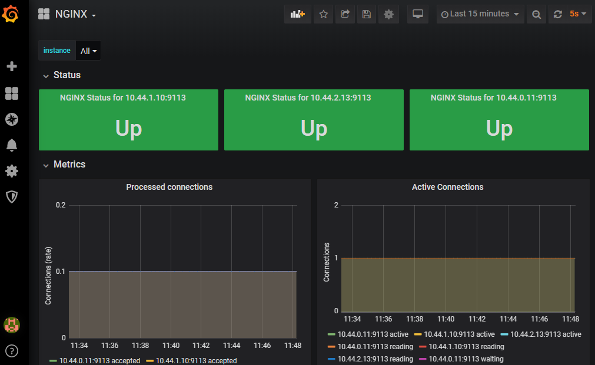

- Установлен Prometheus Operator при помощи Helm
  ```bash
  kubectl create ns monitoring
  helm upgrade --install prometheus-operator stable/prometheus-operator --namespace=monitoring
  ```

- Создан docker image c nginx с настройкой метрик: `kubernetes-monitoring\nginx\Dockerfile`

- Создан Deployment, запускающий nginx и  nginx prometheus exporter: `kubernetes-monitoring\deployment.yaml`

- Создан Service, в котором прописаны порты для nginx и exporter: `kubernetes-monitoring\service.yaml`

  Метрики доступны по адресу `http://nginx-service:9113/metrics`

- Создан ServiceMonitor для обнаружения метрик nginx exporter: `kubernetes-monitoring\servicemonitor.yaml`

- Установка manifest:
  ```bash
  kubectl apply -f deployment.yaml
  kubectl apply -f service.yaml
  kubectl apply -f servicemonitor.yaml
  ```
  
- Создание LoadBalancer
  
  ```bash
  kubectl expose deployment prometheus-operator-grafana --type=LoadBalancer --port 3000 --name prometheus-operator-grafana-lb
  ```
  
  Доступ к grafana будет по адресу `http://34.72.1.161:3000/`
  
- Пример dashboard

  